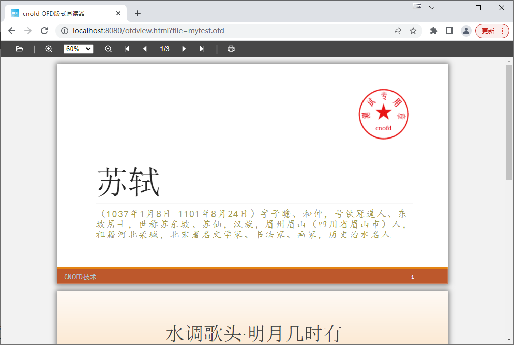

# OFDView
## 介绍

&emsp;**OFDView**是一个采用HTML5、SVG技术构建的OFD版式阅读器。

&emsp;**OFDView**提供OFD文件打开、预览、打印、翻页、页面缩放等常用操作功能，支持在PC、平板和手机上使用，兼容IE、Edge、Chrome、Firefox等主流浏览器，以及微信、QQ、支付宝等内置浏览器。

## 效果示例： 

## 快速上手
<ul dir="auto">
<li>

1.参考“ofdview.html”范例，把“cnofd.css”和“cnofd.umd.min.js”文件引入您的Html文件即可。

</li>
<li>

2.除了通过页面自带“打开”按钮选择浏览器本地OFD文件外，OFDView提供file参数，用于加载远程OFD文件。如：http://localhost:8080/ofdview.html?file=mytest.ofd

</li>
<li>

3.OFDView提供scale参数，指定实际大小（1.0），自定义缩放比例（1.5等），或者自适应页面宽度（width）。如：http://localhost:8080/ofdview.html?file=mytest.ofd&scale=width

</li>
</ul>

## 技术文档
<ul dir="auto">
<li>

技术官网/在线演示：  <a href="http://www.cnofd.cn:18080" target="view_window" rel="nofollow">http://www.cnofd.com.cn:18080/</a>

</li>
</ul>

## 交流互动
<ul dir="auto">
<li>

QQ交流群：

</li>
</ul>

&emsp;

